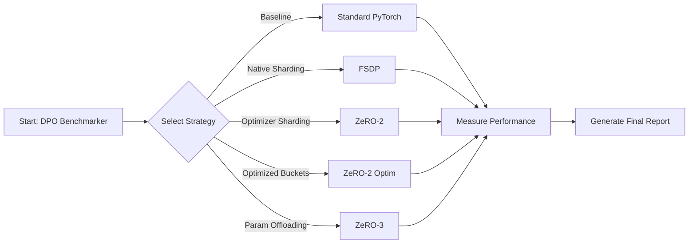

# DPO Training Benchmark
### Performance Comparison of Distributed Training Methods for LLMs

    

> **A systematic tool to evaluate Standard, FSDP, and DeepSpeed strategies on dual T4 GPUs.**

---

## 🌟 Overview

Welcome to the **DPO Performance Master Benchmarker**. This project is a rigorous comparative analysis of state-of-the-art distributed training strategies for **Direct Preference Optimization (DPO)**.

Designed specifically for constrained environments (like Kaggle's Dual T4 setup), this benchmark pushes the boundaries of what's possible with limited VRAM, comparing **Standard**, **FSDP**, and various **DeepSpeed ZeRO** stages to find the ultimate efficiency winner.



---

## 🏎️ The Showdown: Performance Results

We pushed 5 different training strategies to the limit using the **TinyLlama-1.1B** model on the **Anthropic/hh-rlhf** dataset. Here is the definitive ranking based on real-world execution:

### � The Leaderboard

| Rank | Strategy | Throughput (Samples/s) | Speedup vs Standard | Memory (GB) | Status |
| :---: | :--- | :---: | :---: | :---: | :---: |
| 🥇 | **ZeRO-2 Optimized** | **4.31** 🚀 | **+61.4%** | 3.62 | **WINNER** |
| 🥈 | **ZeRO-2** | 3.71 | +39.0% | 3.62 | Excellent |
| 🥉 | **Standard** | 2.67 | Baseline | **2.48** | Baseline |
| 4️⃣ | **FSDP** | 1.74 | -34.8% | 2.91 | Slow Overhead |
| 5️⃣ | **ZeRO-3** | 0.82 | -69.3% | 4.20 | CPU Bound |

### � Visual Analysis

**Throughput (Higher is Better)**
```text
ZeRO-2 Optim : ▓▓▓▓▓▓▓▓▓▓▓▓▓▓▓▓▓▓▓▓ 4.31
ZeRO-2       : ▓▓▓▓▓▓▓▓▓▓▓▓▓▓▓▓░░░░ 3.71
Standard     : ▓▓▓▓▓▓▓▓▓▓▓▓░░░░░░░░ 2.67
FSDP         : ▓▓▓▓▓▓▓▓░░░░░░░░░░░░ 1.74
ZeRO-3       : ▓▓▓▓░░░░░░░░░░░░░░░░ 0.82
```

**Total Training Time (Lower is Better)**
```text
ZeRO-2 Optim : ▓▓▓▓▓▓ 208s
ZeRO-2       : ▓▓▓▓▓▓▓ 242s
Standard     : ▓▓▓▓▓▓▓▓▓▓ 336s
FSDP         : ▓▓▓▓▓▓▓▓▓▓▓▓▓▓▓ 517s
ZeRO-3       : ▓▓▓▓▓▓▓▓▓▓▓▓▓▓▓▓▓▓▓▓▓▓▓▓▓▓▓▓▓▓▓ 1097s
```

> **💡 Insight:** DeepSpeed **ZeRO-2 Optimized** is the clear winner for models that fit in VRAM. ZeRO-3 is powerful but excessively slow for small models due to CPU offload overhead, making it overkill for a 1B model on T4s.

---

## �️ Strategy Breakdown

### 1. Standard PyTorch
*The Baseline.* Simple data parallelism. Good for debugging but doesn't handle memory spikes well.
* **Verdict**: Good stability, average speed.

### 2. DeepSpeed ZeRO-2 (Optimized) 👑
*The Speed Demon.* Shards optimizer states and gradients across GPUs. The "Optimized" version tweaks `bucket_size` to minimize communication latency between the two T4 cards.
* **Verdict**: **Best Performance.** Drastic reduction in training time.

### 3. FSDP (Fully Sharded Data Parallel)
*The Heavyweight.* PyTorch's native answer to ZeRO. While powerful for massive clusters, the sharding overhead on just 2 GPUs for a small model actually hurt performance here.
* **Verdict**: Not recommended for < 7B models on small clusters.

### 4. DeepSpeed ZeRO-3
*The Memory Saver.* Offloads everything to CPU RAM. It allows training massive models (e.g., 70B+) on small GPUs, but at a massive speed cost due to PCIe bandwidth bottlenecks.
* **Verdict**: Essential for OOM errors, but too slow for speed benchmarking.

---

## 💻 Installation & Usage

### Step 1: Initialize Environment
This script handles the complex dependency web between Numpy, Pandas, and Transformers.

```bash
# Clean install to fix header incompatibility
pip uninstall -y transformers trl peft numpy pandas
pip install -q numpy==1.26.4
```

### Step 2: Run the Benchmark
Execute the notebook `Dpo.ipynb`. The system will automatically:
1.  **Generate Configs**: Create `ds_config_*.json` files dynamically.
2.  **Launch Workers**: Spawns isolated processes for each method.
3.  **Aggregate Data**: Parses output logs to build the final comparison table.

```python
# snippet from Dpo.ipynb
setup_files()
run()
table()
```

---

## � Future Roadmap
- [ ] Add **QLoRA** vs **LoRA** comparison.
- [ ] Implement **Unsloth** backend for 2x performance boost.
- [ ] Add **WandB** logging integration for loss curves.

---

*Comparison data generated on 2025-12-21 | Kaggle T4 x2 Environment*
